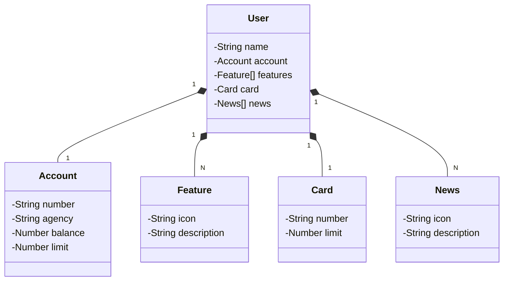

# Bradesco bootcamp 2025

Java RESTful API criada para o Bradesco bootcamp.

O Figma foi utilizado para a abstração do domínio desta API, sendo útil na análise e projeto da solução.

## Diagrama de Classes

